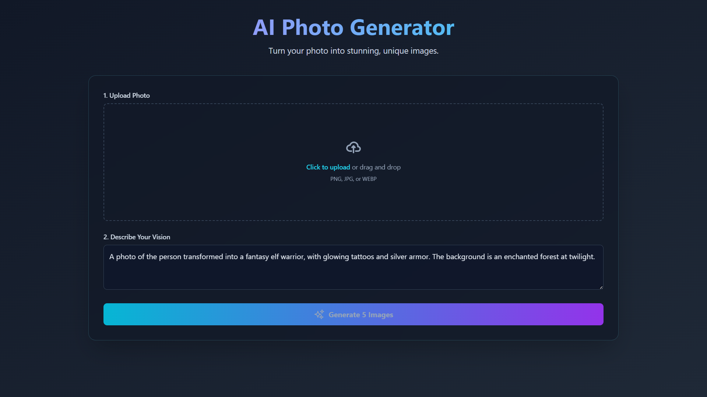

# AI Photo Generator - [🔗Live](https://aiphotgen-phi-two.vercel.app/)

This is a modern, web-based AI image generation tool built with React, Vite, TypeScript, and the Google Gemini API. It allows users to upload a source photo, provide a descriptive prompt, and generate unique, high-quality images. The application features an advanced inpainting tool for refining specific areas of an image, giving users precise creative control.

## 

## ✨ Features

- **Image-to-Image Generation**: Transforms a user-uploaded photo based on a text prompt.
- **Parallel Generation**: Creates 5 unique image variations at once for more options.
- **Interactive Refinement**: Select any generated image to perform targeted edits.
- **Inpainting with Masking**: A powerful brush tool allows users to "paint" over a specific area of an image they wish to change, applying the refinement prompt only to that region.
- **Full-Screen Preview**: View generated images in a high-resolution, full-screen modal.
- **Download Results**: Easily save your favorite creations with the correct file extension.
- **Responsive & Modern UI**: A sleek, "glassmorphism" interface with smooth animations, built with Tailwind CSS.

---

## 🛠️ Tech Stack

- **Frontend**: [React](https://reactjs.org/), [TypeScript](https://www.typescriptlang.org/), [Vite](https://vitejs.dev/)
- **Styling**: [Tailwind CSS](https://tailwindcss.com/)
- **AI Model**: [Google Gemini API](https://ai.google.dev/) (`gemini-2.5-flash-image-preview`)

---

## 🚀 Getting Started

Follow these instructions to get a copy of the project up and running on your local machine for development and testing purposes.

### Prerequisites

- [Node.js](https://nodejs.org/) (version 18.x or newer recommended)
- `npm` or a compatible package manager
- A [Google Gemini API Key](https://ai.google.dev/pricing)

### Installation & Setup

1.  **Clone the repository:**

    ```bash
    git clone https://github.com/mrpawarGit/AI-Photo-Generator.git
    cd AI-Photo-Generator
    ```

2.  **Install dependencies:**

    ```bash
    npm install
    ```

3.  **Set up environment variables:**

    - Create a new file named `.env.local` in the root of your project directory.
    - Add your Google Gemini API key to this file:

    ```env
    # .env.local
    VITE_GEMINI_API_KEY="YOUR_API_KEY_HERE"
    ```

    > **Important:** The `.env.local` file is listed in `.gitignore` and should never be committed to your repository.

4.  **Run the development server:**
    ```bash
    npm run dev
    ```
    The application will now be running on `http://localhost:5173` (or the next available port).

---

## 📜 Available Scripts

In the project directory, you can run:

- `npm run dev`: Starts the Vite development server with Hot Module Replacement (HMR).
- `npm run build`: Compiles the TypeScript and React code and bundles the application for production into the `dist` folder.
- `npm run lint`: Lints the source code using ESLint to find and fix problems.
- `npm run preview`: Starts a local server to preview the production build from the `dist` folder.

---

## 🌐 Deployment

This Vite project is ready for deployment to any modern static hosting service like Vercel, Netlify, or GitHub Pages.

Here is a general guide for deploying to **Vercel**:

1.  **Push to GitHub:** Create a GitHub repository and push your code.

2.  **Import Project in Vercel:**

    - Sign up for a Vercel account and connect it to your GitHub.
    - From the Vercel dashboard, click "Add New... > Project".
    - Import your GitHub repository.

3.  **Configure Project:**

    - Vercel will automatically detect that you are using Vite and configure the build settings. You should not need to change anything here.
    - **Crucially**, you must add your environment variable. Go to the project's **Settings > Environment Variables**.
    - Add a new variable with the following details:
      - **Name:** `VITE_GEMINI_API_KEY`
      - **Value:** Paste your actual Gemini API key here.

4.  **Deploy:** Click the "Deploy" button. Vercel will build your project and deploy it to a public URL.

---
